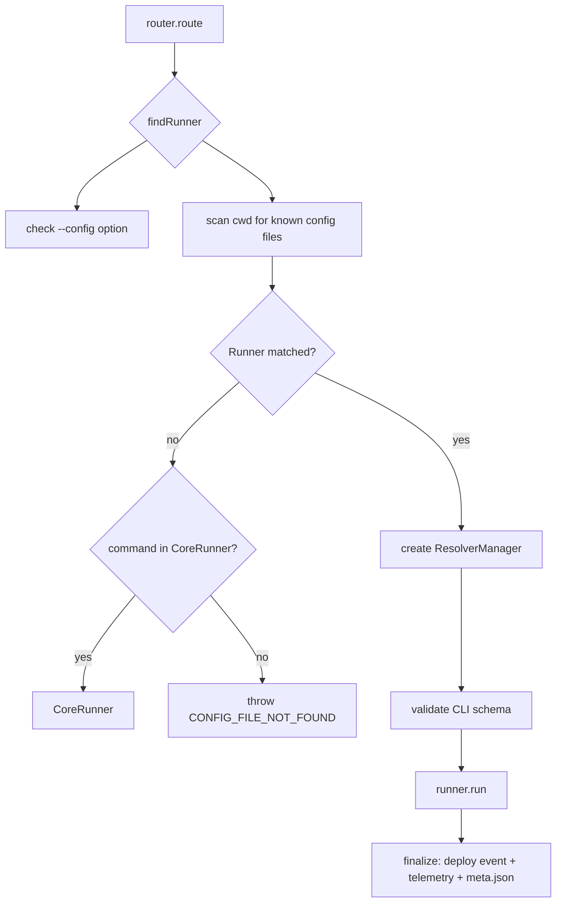

# CLI Runner System (`@serverlessinc/sf-core`)

The sf-core package is the main CLI entry point. It wraps the legacy framework, container engine, and AI framework under a unified command interface.

---

## Entry Flow

```
bin/sf-core.js
  │  ┌─ yargs parses argv (--param always array, no camel-case, no number parsing)
  │  └─ errorHandler for uncaughtException / unhandledRejection
  │
  └─ src/index.js (run())
       ├─ setupLogging() — SLS_DEBUG / SLS_VERBOSE / --debug / --verbose
       ├─ create progress spinner ("main")
       ├─ getVersions()
       └─ router.route({ command, options, versions })
```

---

## Router (`src/lib/router.js`)

The router determines which **Runner** to use and orchestrates execution + finalization.

### Runner Selection



### Runner Detection Order

Runners are checked in this order. The first to match wins:

| # | Runner | Config File Prefixes | Delegates To |
|---|---|---|---|
| 1 | `ComposeRunner` | `serverless-compose` | Multi-service orchestration |
| 2 | `CfnRunner` | `samconfig`, `template` | Raw SAM/CloudFormation |
| 3 | `ServerlessContainerFrameworkRunner` | `serverless.containers` | `@serverless/engine` |
| 4 | `ServerlessAiFrameworkRunner` | `serverless.ai` | `@serverless/engine` |
| 5 | `TraditionalRunner` | `serverless` | `@serverless/framework` |
| — | `CoreRunner` | (no config needed) | Built-in commands (login, logout, usage, etc.) |

---

## Runner Base Class (`src/lib/runners/index.js`)

All runners extend a common base that provides:

**Template methods:**
- `resolveVariablesAndAuthenticate()` — ordered pipeline:
  1. Resolve early params (`env`, `opt`, `file`, `sls`, `strToBool`, `git`, `self`, `param`)
  2. Resolve org/app/service/region from config
  3. Resolve provider profile
  4. Add default AWS credential resolver
  5. Resolve license key (from env → SSM → .serverlessrc)
  6. Authenticate via `Authentication` class (V1 key → V2 license key → browser OAuth)
  7. Load dashboard data (if configured)
  8. Process notifications (blocking deploy/package if needed)
  9. Resolve all remaining variables via the resolver manager
- `resolveVariables({ printResolvedVariables })` — just the resolution step
- `resolveStateStore({ credentialProvider })` — configures S3-backed state persistence
- `reloadConfig({ configFilePath })` — re-reads config after variable resolution
- `getProviderCredentials({ providerName })` / `fetchData()` / `storeData()`

**Required overrides:**
- `static configFileNames()` — array of prefixes to match
- `static shouldRun({ config, configFilePath })` — whether this runner matches
- `getCliSchema()` — yargs command/options schema
- `run()` — returns `{ serviceUniqueId, state? }`
- `getServiceUniqueId()`

---

## Runner Details

### TraditionalRunner

- **Purpose:** Deploy traditional `serverless.yml` services using the legacy plugin engine (`@serverless/framework`).
- **Flow:** Resolves variables → authenticates → loads the `Serverless` class from `@serverless/framework` → calls `serverless.run()` with the command.
- **Config:** `serverless.{yml,yaml,json,js,ts}`

### ComposeRunner

- **Purpose:** Orchestrate multi-service deployments with dependency graphs.
- **Config:** `serverless-compose.{yml,yaml}`
- **Flow:** Parse compose config → resolve each service's variables → execute the dependency graph (respecting cross-service `output` references).
- **Key files:** `src/lib/compose/` — graph parsing, state resolution, execution engine.

### CfnRunner

- **Purpose:** Deploy raw SAM or CloudFormation templates.
- **Config:** `samconfig.{yml,yaml,toml}`, `template.{yml,yaml,json}`
- **Flow:** Reads the SAM config or template file, resolves CloudFormation parameters, delegates to the engine's CloudFormation service for stack operations.

### ServerlessContainerFrameworkRunner (SCF)

- **Purpose:** Deploy containerized apps defined in `serverless.containers.yml`.
- **Config:** `serverless.containers.{yml,yaml}`
- **Flow:** Resolves variables → validates config against Zod schema → creates `ServerlessContainerFramework` instance (which wraps `@serverless/engine`) → delegates deploy/dev/info/remove to the engine.

### ServerlessAiFrameworkRunner (SAI)

- **Purpose:** Deploy AI agent apps defined in `serverless.ai.yml`.
- **Config:** `serverless.ai.{yml,yaml}`
- **Flow:** Same as SCF but hardcodes `deploymentType` to `sfaiAws@1.0` and validates against an AI-specific Zod schema.

### CoreRunner

- **Purpose:** Handle meta-operations that don't need a service config.
- **Commands:** `login`, `login-aws`, `logout`, `register`, `support`, `usage`, `reconcile`, `plugin install/uninstall/list`, `mcp` (start MCP server), `help`, `version`.

---

## Finalization Pipeline

After `runner.run()` completes (or fails), `finalize()` runs three tasks in **parallel** via `Promise.allSettled()`:

1. **Deployment event** — reports deployment metadata to the Serverless Dashboard API (for Dashboard-enabled services).
2. **Usage + analysis telemetry** — sends anonymous usage data to Serverless Inc.
3. **Meta info save** — writes `meta.json` with service configuration and telemetry.

Errors in finalization do **not** propagate to the user (fire-and-forget).

---

## CLI Schema Validation

Each runner provides a `getCliSchema()` that defines its CLI commands and options. The router validates parsed argv against this schema via `validateCliSchema()` before running. Help and version commands exit early without requiring a runner.

---

## Authentication System (`src/lib/auth/index.js`)

The `Authentication` class (1602 lines) manages four authentication paths with fallback:

1. **Access Key V1** (user-level) — env `SERVERLESS_ACCESS_KEY` / `SERVERLESS_USER_ACCESS_KEY`, or generated from user session.
2. **License Key / Access Key V2** (org-level) — env `SERVERLESS_LICENSE_KEY` / `SERVERLESS_ORG_ACCESS_KEY`, or SSM parameter `/serverless-framework/license-key`, or `.serverlessrc`.
3. **User Session** — browser-based OAuth flow, tokens stored in `.serverlessrc`. Supports refresh tokens and SSO.
4. **Interactive Fallback** — prompts user to login/register or paste a license key.

The class:
- Calls `CoreSDK` (`@serverless-inc/sdk`) to validate keys and fetch org info.
- Manages `.serverlessrc` as a credential cache.
- Handles SSO login (AWS SSO for AWS credentials, Okta/Azure AD for Dashboard).
- Supports `--console-login` flag for headless environments.

---

## Notification System (`src/lib/runners/notification.js`)

- `sanitizeNotifications()` — normalizes BFF notifications, sorts blocking notifications to end, appends built-in notifications.
- `handleAndMaybeThrowNotifications()` — renders notifications with throttling (via `.serverlessrc` timestamps), throws `COMMAND_BLOCKED_BY_NOTIFICATION` for blocking notifications on `deploy`/`package`.
