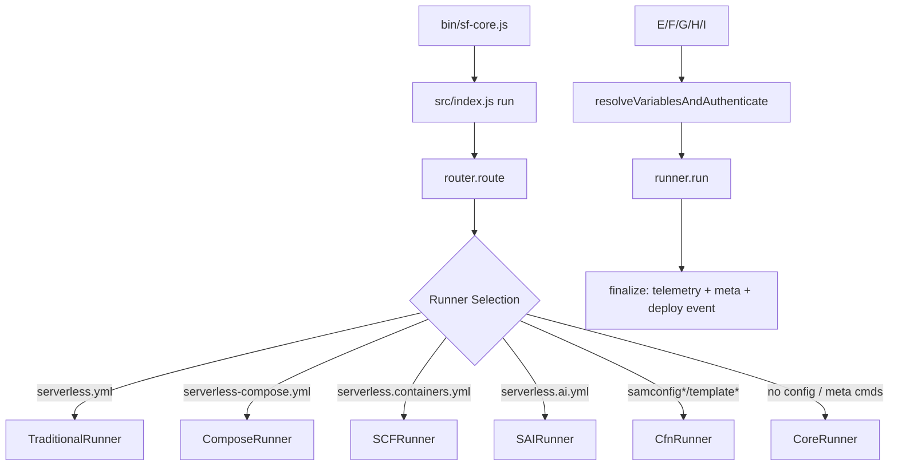
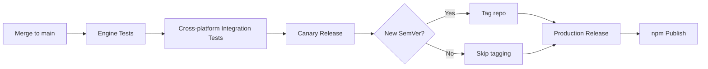

# Serverless Framework V.4 — Project Analysis

**Generated:** 2026-07-03
**Repository:** `github.com/serverless/serverless`
**Root:** `C:\Users\kktam\Documents\code\3party\serverless`

---

## 1. Overview

The **Serverless Framework V.4** is a CLI tool for deploying serverless applications to AWS Lambda and other managed cloud services. Users define infrastructure in YAML config files (`serverless.yml`, `serverless.containers.yml`, `serverless.ai.yml`, `serverless-compose.yml`, or raw SAM/CloudFormation templates), and the framework compiles that into CloudFormation templates, packages code, uploads artifacts to S3, and orchestrates the deployment lifecycle. The project is structured as an **npm workspaces monorepo** containing **8 packages** under `packages/` plus a Go binary installer.

| Attribute            | Value                                         |
|----------------------|-----------------------------------------------|
| Current version      | `4.38.1` (sf-core) / `4.0.0` (serverless)    |
| Package manager      | npm workspaces                                |
| Monorepo tooling     | npm workspaces + Husky + lint-staged          |
| Node requirement     | `>=18.0` (`>=18.17` for installer)            |
| Language             | JavaScript (ES Modules) + Go (binary installer)|
| License              | MIT (with proprietary components in V.4)      |
| Supported configs    | serverless.yml, serverless-compose.yml, serverless.containers.yml, serverless.ai.yml, SAM templates, CloudFormation templates |
| Supported clouds     | AWS (primary); other providers deprecated      |
| Deployment targets   | AWS Lambda, ECS Fargate                       |

---

## 2. Build & Development Toolchain

### 2.1 Build Systems

| Tool              | Version     | Purpose                                                       |
|-------------------|-------------|---------------------------------------------------------------|
| esbuild           | 0.28.1      | Bundles sf-core CLI into single distributable file            |
| Go (native binary)| 1.x         | Compiles the platform-specific `serverless` binary installer  |
| Husky             | 9.1.7       | Git pre-commit hooks via lint-staged                          |
| lint-staged       | 16.4.0      | Runs Prettier on staged `*.{js,ts,tsx,jsx}` files             |

### 2.2 Language Configuration

**ES Modules:** The project is 100% ESM (`"type": "module"` in root and all packages). No CommonJS `require()`.

**ESLint (`eslint.config.js` — flat config):**
- Extends `packages/standards/src/eslint.js` (based on `@eslint/js` recommended + `eslint-config-prettier`)
- Targets: sf-core, serverless, engine, mcp, util, standards, installer, release-scripts
- Ignores: `node_modules/`, `dist/`, `.serverless/`, `coverage/`, dev shim

**Prettier (`prettier.config.js`):**
- No semicolons, single quotes, 2-space indent, trailing commas, print width 120, LF line endings
- Config lives in `packages/standards/src/prettier.js`

### 2.3 Testing

| Tool   | Version | Purpose                       |
|--------|---------|-------------------------------|
| Jest   | 30.4.2  | Primary test runner (all packages) |
| tape   | 5.9.0   | (sf-core dev dep, limited use)|

**Jest configuration highlights:**
- No transforms (`transform: {}` — native ESM)
- `--experimental-vm-modules` flag required for ESM support
- Integration test timeout: 600s (10 minutes)
- Mocking: `jest.unstable_mockModule()` for ESM modules (native ESM mocking, no jest.mock())

### 2.4 Pre-commit Hooks
- Prettier auto-format on staged `*.{js,ts,tsx,jsx}` files (via Husky + lint-staged)

---

## 3. Monorepo Architecture

### 3.1 Workspace Layout

```
serverless/
├── packages/
│   ├── sf-core/              # Main CLI framework — runner system, resolver, auth (#7)
│   ├── serverless/           # Legacy plugin architecture — deploy pipeline, AWS provider (#8)
│   ├── engine/               # Container framework engine — SCF/SAI deployments (#9)
│   ├── mcp/                  # MCP server for AI IDEs (#10)
│   ├── util/                 # Shared utilities — logging, progress, Docker, AWS proxy
│   ├── standards/            # ESLint + Prettier shared configs
│   ├── sf-core-installer/    # npm wrapper that downloads the Go binary
│   └── framework-dist/       # Built distribution artifacts (excluded from workspaces)
├── binary-installer/         # Go binary — version manager + Node.js launcher (#11)
├── release-scripts/          # MongoDB + S3 release metadata publishing (#12)
├── docs/                     # User-facing documentation (sf + scf subdirectories)
└── .github/workflows/        # 7 CI/CD workflow files (#13)
```

### 3.2 Package Dependency Graph

```
binary-installer (Go)
    └── spawns ──> sf-core (built artifact @ serverlessinc/sf-core)
                       ├── @serverless/framework (*)    — traditional runner
                       ├── @serverless/engine (*)       — container/AI runner
                       ├── @serverless/mcp (*)          — MCP server
                       └── @serverless/util (*)         — shared utilities
                            └── @serverlessinc/standards (*) — lint configs
```

(*) = inter-package workspace dependency

### 3.3 Versioning Strategy

- **sf-core** and **serverless-installer** share version `4.38.1`
- **serverless** package: `4.0.0` (core legacy framework version)
- **engine, mcp, util, standards**: independently versioned (`1.0.0`)
- Strict **Semantic Versioning**:
  - PATCH: backwards-compatible bug fixes
  - MINOR: new backwards-compatible features
  - MAJOR: breaking changes (CFn output, CLI commands, plugin API)

---

## 4. Core Framework — `@serverlessinc/sf-core` (v4.38.1)

### 4.1 Source Directory Structure

```
packages/sf-core/
├── bin/sf-core.js              # CLI entry point (yargs parser)
├── src/
│   ├── index.js                # run() — logging, progress, version, router dispatch
│   ├── utils.js                # Barrel re-export of utility modules
│   ├── utils/
│   │   ├── cli/cli.js          # Yargs CLI argument extraction + schema validation
│   │   ├── credentials/        # AWS credential provider resolution
│   │   ├── fs/                 # File-system helpers (read, write, YAML AST, config, hash)
│   │   ├── general/            # Short IDs, diff, time formatting
│   │   └── https/              # HTTPS download, repo URL parsing
│   ├── lib/
│   │   ├── router.js           # Central command dispatcher — selects Runner class
│   │   ├── runners/            # Runner implementations (6 runners)
│   │   ├── resolvers/          # Variable resolution system (${source:key} interpolation)
│   │   ├── auth/               # Authentication (V1/V2 keys, OAuth, SSO)
│   │   ├── compose/            # Multi-service orchestration (serverless-compose.yml)
│   │   ├── core/               # Core runners (onboarding, login, mcp, support, reconcile)
│   │   ├── cfn/                # SAM/CloudFormation runner
│   │   ├── frameworks/         # Framework adapters (SCF, SAI)
│   │   ├── platform/           # Deployment record management (CoreSDK integration)
│   │   └── observability/      # Observability providers (Axiom, Dashboard, disabled)
│   └── esbuild.js              # Build script (bundles CLI)
└── tests/
    ├── unit/                   # Unit tests (run locally)
    ├── resolvers/              # Golden-file-based variable resolution tests
    └── integration/            # Full E2E tests (CI only — require AWS creds)
```

### 4.2 CLI Entry Point (`bin/sf-core.js`)

- Shebang: `#!/usr/bin/env node`
- Uses `yargs` with `parse-numbers: false`, `camel-case-expansion: false`
- `--param` forced to always be an array
- Splits `argv._` into `command []` and remaining `options`
- Delegates to `ServerlessCore.run({ command, options, debug, verbose })`
- Global `errorHandler`: cleans up progress spinners, logs error with guidance, `process.exit(1)`
- Registers `uncaughtException` / `unhandledRejection` handlers

### 4.3 Runner System (Strategy Pattern)

The router in `src/lib/router.js` selects a runner based on detected config file:



| Runner | Config Prefix | Delegates To | Commands |
|--------|--------------|--------------|----------|
| `TraditionalRunner` | `serverless` | `@serverless/framework` | deploy, remove, info, invoke, logs, etc. |
| `ComposeRunner` | `serverless-compose` | Built-in graph executor | deploy, remove, info |
| `ServerlessContainerFrameworkRunner` | `serverless.containers` | `@serverless/engine` | deploy, dev, info, remove, init |
| `ServerlessAiFrameworkRunner` | `serverless.ai` | `@serverless/engine` (sfaiAws mode) | deploy, dev, info, remove, init |
| `CfnRunner` | `samconfig`, `template` | Engine's CloudFormation service | deploy, remove, info |
| `CoreRunner` | (none) | Built-in handlers | login, logout, register, support, usage, reconcile, plugin install, mcp |

**Runner base class** (`src/lib/runners/index.js`) provides shared template methods:
- `resolveVariablesAndAuthenticate()` — 9-step pipeline
- `resolveVariables()`, `resolveStateStore()`, `reloadConfig()`
- `getProviderCredentials()`, `fetchData()`, `storeData()`

### 4.4 Finalization Pipeline

After `runner.run()`, three parallel fire-and-forget tasks via `Promise.allSettled()`:

1. **Deployment event** — reports metadata to Serverless Dashboard API
2. **Usage + analysis telemetry** — sends anonymous usage data
3. **Meta info save** — writes `meta.json`

---

## 5. Variable Resolution System (`@serverlessinc/sf-core`)

The resolver handles `${source:key}` variable interpolation in YAML configs — a DAG-based parallel resolution engine.

### 5.1 Architecture

```
src/lib/resolvers/
├── index.js          # createResolverManager() bootstrap
├── manager.js        # ResolverManager class (1357 lines)
├── graph.js          # processGraphInParallel() — parallel DAG executor
├── placeholders.js   # ${...} extraction from YAML
├── env.js            # .env file loading
├── validation.js     # Config validation
├── providers.js      # Provider abstraction layer
├── providers/        # 16 concrete providers
│   ├── env/          # ${env:VAR}
│   ├── opt/          # ${opt:option}
│   ├── file/         # ${file(./path):export}
│   ├── self/         # ${self:property}
│   ├── sls/          # ${sls:stage}
│   ├── param/        # ${param:name}
│   ├── output/       # ${output:service.output} (cross-service)
│   ├── git/          # ${git:branch}
│   ├── strToBool/    # ${strToBool:value}
│   ├── aws/ssm/      # ${aws:ssm:/path}
│   ├── aws/s3/       # ${aws:s3://bucket/key}
│   ├── aws/cf/       # ${aws:cf:stack.OutputKey}
│   ├── aws/credentials/
│   ├── vault/        # Vault secrets
│   ├── terraform/    # Terraform state
│   └── doppler/      # Doppler secrets
└── registry/         # Plugin-contributed resolver registration
```

### 5.2 Bootstrap Sequence

```
1. Validate config (no params+stages conflict, valid resolver configs)
2. Create ResolverManager
3. Load placeholders → build dependency graph (nodes = placeholders, edges = dependencies)
4. Resolve stage (CLI --stage → SLS_STAGE → provider.stage → "dev")
5. Load .env files (.env → .env.{stage} → .env.{stage}.local)
6. Resolve provider.resolver key
7. Set credential resolver
8. Prune unused stages (remove inactive stage branches from config)
9. Reload placeholders with credential resolver edges
10. Load all resolvers (ComposeRunner only)
```

**Two-phase resolution:** Limited providers resolve before authentication, full resolution after.

**Limited providers (pre-auth):** `env`, `opt`, `file`, `sls`, `strToBool`, `git`, `self`, `param` — no network/credentials needed.

### 5.3 Graph Processing Algorithm

`processGraphInParallel()` (in `graph.js`):
1. Build adjacency lists from `@dagrejs/graphlib` Graph
2. Find sink nodes = nodes with 0 outgoing edges (no dependents)
3. Process sink nodes concurrently via `Promise.all`
4. When a node completes, remove its edges → new sinks emerge
5. Repeat until all nodes resolved

**Directed edges:** A→B means "A depends on B" → B resolves first. Sinks have dependents (outgoing edges) but no dependencies (incoming edges).

---

## 6. Authentication System

The `Authentication` class (`src/lib/auth/index.js`, 1602 lines) handles four authentication paths:

| Priority | Method | Source |
|----------|--------|--------|
| 1 | Access Key V1 (user-level) | Env `SERVERLESS_ACCESS_KEY` / `SERVERLESS_USER_ACCESS_KEY`, or user session |
| 2 | License Key V2 (org-level) | Env `SERVERLESS_LICENSE_KEY` / `SERVERLESS_ORG_ACCESS_KEY`, or SSM param `/serverless-framework/license-key`, or `.serverlessrc` |
| 3 | User Session | Browser-based OAuth → tokens in `.serverlessrc` (supports refresh + SSO) |
| 4 | Interactive Fallback | Prompts user to login/register or paste license key |

The class calls `CoreSDK` (`@serverless-inc/sdk`) to validate keys and fetch org info, manages `.serverlessrc` as a credential cache, handles SSO login, and supports `--console-login` for headless environments.

---

## 7. Traditional Plugin System — `@serverless/framework` (v4.0.0)

### 7.1 Source Directory Structure

```
packages/serverless/lib/
├── serverless.js                   # Serverless class — init() + run()
├── serverless-error.js             # Custom error class
├── config-schema.js                # Config validation schemas
├── classes/
│   ├── cli.js                      # CLI argument parsing and output
│   ├── config.js                   # Configuration helper
│   ├── config-schema-handler/      # AJV-based config validation
│   ├── plugin-manager.js           # Plugin lifecycle orchestration (1072 lines)
│   ├── service.js                  # Service model (reads serverless.yml)
│   └── utils.js                    # Miscellaneous utilities
├── cli/
│   ├── commands-schema.js          # All CLI commands + lifecycle events (Map)
│   ├── commands-options-schema.js
│   ├── parse-args.js
│   ├── resolve-input.js
│   ├── render-help/
│   └── write-service-outputs.js
├── commands/
│   └── plugin-management.js        # sls plugin install/uninstall/list
├── configuration/
│   └── read.js                     # YAML/JSON/TS/TOML/JS config reader
├── aws/
│   ├── request.js                  # Universal AWS request dispatcher
│   ├── v2/request.js               # AWS SDK v2 implementation
│   ├── v3/request.js               # AWS SDK v3 implementation
│   ├── v3/client-factory.js        # Dynamic v3 client creation
│   ├── request-queue.js            # Concurrency limiter (max 2)
│   └── request-retry.js            # Exponential backoff retry
├── plugins/
│   ├── index.js                    # Dynamic module loader
│   ├── deploy.js                   # Generic deploy command
│   ├── dev.js                      # Dev mode command
│   ├── diff.js                     # CloudFormation diff
│   ├── info.js / invoke.js / logs.js / metrics.js / remove.js / rollback.js
│   ├── package/                    # Generic packaging (zips service)
│   ├── plugin/                     # Plugin management
│   ├── prune/                      # Lambda version pruning
│   ├── python/                     # Python requirements (uv-based)
│   ├── esbuild/                    # Built-in TypeScript bundler (1234 lines)
│   ├── observability/              # Dashboard observability
│   └── aws/                        # *** AWS provider plugins ***
│       ├── provider.js             # AwsProvider class (4232 lines)
│       ├── common/                 # Shared lifecycle (validate, temp dirs, artifacts)
│       ├── deploy/                 # CloudFormation stack deployment
│       │   └── lib/                # create-stack, check-for-changes, upload-artifacts...
│       ├── package/                # CloudFormation resource compilation
│       │   └── compile/
│       │       ├── functions.js    # Lambda function resources (1473 lines)
│       │       ├── layers.js       # Lambda layer resources
│       │       └── events/         # 23 event compile plugins
│       ├── invoke-local/           # Local Lambda invocation
│       ├── invoke-agent.js         # Bedrock agent invocation
│       ├── logs-agent.js           # Agent logs
│       ├── deploy-function.js      # Deploy single function
│       ├── deploy-list.js          # List deployed versions
│       ├── alerts/                 # CloudWatch alarms
│       ├── domains/                # Custom domain names (API Gateway)
│       ├── appsync/                # AppSync GraphQL API
│       ├── bedrock-agentcore/      # Bedrock Agent integrations
│       └── lib/                    # Shared AWS utilities (naming, monitor, upload, etc.)
└── utils/
    ├── fs/
    ├── npm-package/
    └── log-deprecation.js
```

### 7.2 Plugin System Architecture

The `PluginManager` (`lib/classes/plugin-manager.js`, 1072 lines) orchestrates ~55 bundled internal plugins:

**Plugin structure:**
```javascript
class MyPlugin {
  constructor(serverless, options) {
    this.commands = {
      myCommand: {
        usage: 'Description',
        lifecycleEvents: ['event1', 'event2'],
      },
    }
    this.hooks = {
      'before:myCommand:event1': async () => { ... },
      'myCommand:event1': async () => { ... },
      'after:myCommand:event1': async () => { ... },
    }
    this.provider = 'aws'  // optional: only load for specific provider
  }
}
```

**Lifecycle execution:**
1. Run all `initialize` hooks
2. For each command: fire `before:<cmd>:<event>` → `<cmd>:<event>` → `after:<cmd>:<event>`
3. On error → fire all `error` hooks
4. Always → fire all `finalize` hooks

**Nested lifecycles:** `pluginManager.spawn('aws:deploy:deploy:createStack')` invokes sub-lifecycles.

**External plugins:** Loaded from service's `node_modules`, searched via `requireServicePlugin()` (service node_modules → framework node_modules → TypeScript loader).

### 7.3 CLI Commands

| Command | Lifecycle Events | Service Required |
|---------|-----------------|-----------------|
| `print` | `[print]` | Yes |
| `help` | `[]` | Optional |
| `package` | `[cleanup, initialize, setupProviderConfiguration, createDeploymentArtifacts, compileLayers, compileFunctions, compileEvents, finalize]` | Yes |
| `deploy` | `[deploy, finalize]` | Yes |
| `deploy function` | `[initialize, packageFunction, deploy]` | Yes |
| `deploy list` | `[log]` | Yes |
| `invoke` | `[invoke]` | Yes |
| `invoke local` | `[loadEnvVars, invoke]` | Yes |
| `logs` | `[logs]` | Yes |
| `metrics` | `[metrics]` | Yes |
| `remove` | `[remove]` | Yes |
| `rollback` | `[initialize, rollback]` | Yes |
| `prune` | `[prune]` | Yes |
| `dev` | `[dev]` | Yes |
| `diff` | `[diff]` | Yes |

---

## 8. AWS Provider & Deploy Pipeline

### 8.1 AwsProvider (`lib/plugins/aws/provider.js`, 4232 lines)

Registered via `serverless.setProvider('aws', this)`. Largest single file in the project.

**Responsibilities:**
- Credentials resolution (delegates to sf-core's credential providers)
- AWS SDK management (dual v2/v3 support)
- Configuration schema registration (JSON Schema covering Lambda, IAM, API Gateway, event sources, CloudFormation intrinsics, etc.)
- CloudFormation naming conventions (via `lib/plugins/aws/lib/naming.js`, 964 lines)
- Service methods: `request()`, `getCredentials()`, `getStage()`, `getRegion()`, `getAccountId()`, `getServerlessDeploymentBucketName()`

### 8.2 Dual SDK Request System

| Aspect | v2 Path | v3 Path |
|--------|---------|---------|
| **SDK** | `aws-sdk` v2 | `@aws-sdk/*` modular (3.1057.x) |
| **Selection** | Default | `SLS_AWS_SDK=3` env var |
| **Retry** | Exponential backoff (max 4) | `@smithy/util-retry` |
| **Concurrency** | Request queue (max 2) | N/A (caller-managed) |
| **Proxy** | HTTPS_PROXY + TLS certs | `@smithy/node-http-handler` |
| **S3 Acceleration** | Supported | N/A |
| **Memoization** | Yes | No (command pattern) |

### 8.3 Deploy Pipeline

```
before:deploy:deploy
  ├── aws:common:validate
  ├── setup observability
  └── optionally spawn package lifecycle

deploy:deploy → spawns aws:deploy:deploy:
  ├── createStack
  │   ├── Check if stack exists
  │   └── Create via createStack or change set
  ├── checkForChanges
  │   ├── Compare artifact hashes vs S3
  │   └── Skip if unchanged
  ├── uploadArtifacts
  │   ├── CloudFormation template
  │   ├── State file
  │   ├── Function/layer zip files
  │   └── Custom resources
  ├── validateTemplate (via CloudFormation API)
  ├── updateStack
  │   ├── Direct updateStack OR
  │   └── createChangeSet + executeChangeSet
  └── monitorStack (poll describeStackEvents)

deploy:finalize:
  └── Cleanup S3 bucket
```

### 8.4 Package Compile Pipeline (23 Event Plugins)

The AWS package plugin compiles service config into CloudFormation resources:

```
package:cleanup → initialize → setupProviderConfiguration → createDeploymentArtifacts
  ├── compileLayers    (Lambda Layers)
  ├── compileFunctions (Lambda Functions — 1473 lines)
  └── compileEvents    (23 event source plugins)
      ├── schedule.js            → AWS::Events::Rule / AWS::Scheduler::Schedule
      ├── s3/index.js            → AWS::S3::Bucket + notification config
      ├── api-gateway/index.js   → AWS::ApiGateway::RestApi + resources + methods
      ├── websockets/index.js    → AWS::ApiGatewayV2::Api
      ├── http-api.js            → AWS::ApiGatewayV2::Api (HTTP variant)
      ├── sns.js                 → AWS::SNS::Topic + subscription
      ├── sqs.js                 → Event source mapping for SQS
      ├── stream.js              → DynamoDB/Kinesis stream event source
      ├── kafka.js               → MSK/Self-managed Kafka
      ├── activemq.js / rabbitmq.js → MQ brokers
      ├── msk/index.js           → MSK cluster
      ├── alb/index.js           → ALB target group + listener rules
      ├── event-bridge/index.js  → EventBridge rules + targets
      ├── cloud-watch-event.js   → CloudWatch Events rule
      ├── cloud-watch-log.js     → CloudWatch Logs subscription filter
      ├── cognito-user-pool.js   → Cognito user pool trigger
      ├── cloud-front.js         → CloudFront distribution + behaviors
      ├── iot.js                 → IoT rule
      ├── iot-fleet-provisioning.js → IoT fleet provisioning
      └── alexa-skill.js / alexa-smart-home.js → Alexa skills
```

### 8.5 Built-in esbuild Plugin (`lib/plugins/esbuild/index.js`, 1234 lines)

Default TypeScript/JS bundler hooks into:
- `before:package:createDeploymentArtifacts`
- `before:deploy:function:packageFunction`
- `before:invoke:local:invoke`
- `before:dev-build:build`
- `before:offline:start`

Conflicts with `serverless-webpack`, `serverless-plugin-typescript`, `serverless-bundle`, `serverless-esbuild` (throws error unless `build.esbuild: false`).

### 8.6 Built-in Plugin Overrides

Formerly community plugins now built-in (framework skips internal version if service lists the community one):
- **python-requirements** → built-in `python/` (uv-based)
- **appsync-plugin** → built-in `appsync/`
- **apigateway-service-proxy** → built-in
- **prune-plugin** → built-in `prune/`

---

## 9. Container Engine — `@serverless/engine` (v1.0.0)

### 9.1 Source Directory Structure

```
packages/engine/src/
├── index.js                       # ServerlessEngine — public API
├── types.js                       # Zod config + state schemas (1604 lines)
├── types/
│   ├── aws.js                     # AWS infrastructure schemas (412 lines)
│   ├── containers.js              # Container config schemas
│   └── integrations.js            # Slack, EventBridge schemas
└── lib/
    ├── deploymentTypes/           # Strategy pattern
    │   ├── aws/                   # Full deployment (VPC, ALB, CloudFront, ECS, Lambda, Slack)
    │   │   ├── index.js           # Constructor + dispatch
    │   │   ├── deploy.js          # Deploy orchestration (1143 lines)
    │   │   ├── deployAwsLambda.js # Lambda compute deployment
    │   │   ├── deployAwsFargateEcs.js # Fargate ECS compute deployment
    │   │   ├── remove.js          # Stack teardown
    │   │   ├── detector.js        # AI framework detection
    │   │   └── ... (routing, helpers)
    │   ├── awsApi/                # Simpler ALB-only API deployment
    │   └── sfaiAws/               # AI Framework variant (Slack OAuth, EventBridge)
    ├── devMode/                   # Local Docker dev mode (1492 lines)
    │   └── containers/
    │       └── serverless-dev-mode-proxy/ # Express proxy for local dev
    ├── aws/                       # 22 AWS client wrapper classes
    │   ├── ecs.js                 # ECS client (845 lines)
    │   ├── alb.js                 # ALB client
    │   ├── cloudfront.js          # CloudFront distribution
    │   ├── lambda.js              # Lambda functions
    │   ├── iam.js                 # IAM roles
    │   ├── vpc.js                 # VPC/Networking
    │   ├── ecr.js                 # ECR repositories
    │   ├── cloudformation.js      # CloudFormation stacks
    │   └── ... (22 total)
    └── integrations/
        └── slack.js               # Slack API integration
```

### 9.2 ServerlessEngine Class

```javascript
new ServerlessEngine({
  stateStore: { load, save },  // persistence backend (Dashboard API)
  projectConfig,               // parsed config
  projectPath,                 // filesystem path
  stage,                       // deployment stage
  provider: 'aws',             // only aws supported
})
```

**Dispatch by `deployment.type`:**

| Type | Class | Features |
|------|-------|----------|
| `aws@1.0` | `DeploymentTypeAws` | Full: VPC, ALB, CloudFront, ECS, Lambda, Slack, EventBridge, AI detection |
| `awsApi@1.0` | `DeploymentTypeAwsApi` | Simpler: ALB-only, no CloudFront/Slack/AI |
| `sfaiAws@1.0` | `DeploymentTypeSfaiAws` | AI: Slack OAuth, EventBridge schedules, AI manifest |

**Key lifecycle methods:** `deploy({ force })`, `remove({ all, force })`, `dev({ proxyPort, ... })`, `getDeploymentState()`, `executeCommand(name, options)`

### 9.3 AWS Client Layer

22 thin wrapper classes around AWS SDK v3. Each accepts `awsConfig { region, credentials }` and has proxy support via `@serverless/util`.

| Client | Key Methods |
|--------|-------------|
| `AwsVpcClient` | `getOrCreateVpc()`, `deleteVpc()` |
| `AwsAlbClient` | `getOrCreateLoadBalancer()`, `getOrCreateTargetGroup()`, `getOrCreateListenerRule()` |
| `AwsCloudfrontClient` | `getOrCreateDistribution()`, `updateDistribution()`, `deleteDistribution()` |
| `AwsEcsClient` (845 lines) | `getOrCreateCluster()`, `createOrUpdateService()`, `registerTaskDefinition()` |
| `AwsLambdaClient` | Create/update/delete functions, aliases, provisioned concurrency |
| `AwsEcrClient` | `getOrCreateRepository()`, `getAuthorizationToken()` |
| `AwsIamClient` | Roles, policies, managed policies |
| `AwsCloudformationClient` | `createStack()`, `describeStacks()`, `deleteStack()` |
| `AwsCloudwatchClient` | Metrics, alarms |
| 15 more... | ACM, Route53, S3, SQS, SSM, DynamoDB, EventBridge, API Gateway, Autoscaling, etc. |

### 9.4 Dev Mode

Local Docker-based development via `ServerlessEngineDevMode` (1492 lines):

```
1. docker network create serverless-dev-mode-proxy-network
2. docker run serverless-dev-mode-proxy (Express, port 8080)
3. For each local container:
   ├── docker build (if Dockerfile) or pull runtime image
   ├── docker run with mounted source code
   └── Register route in proxy
4. chokidar watches file changes → restarts affected containers
5. On exit: docker stop + docker rm all
```

**Runtime containers:** Node.js 20, Python 3.12 (configurable image versions).
**Proxy container:** Express-based, handles path-based routing, health checks, hot reload.

### 9.5 Zero-Downtime Compute Migration

When switching a container between Lambda and Fargate ECS:
1. Deploy new compute with deprioritized ALB routing
2. Verify new target is healthy
3. Swap routing priority to the new target
4. Remove old compute

### 9.6 Configuration Validation (Zod v4)

All engine configs validated with Zod v4 schemas:
- **Essential:** `name`, `stage`, `org`, `frameworkVersion`, `stages`
- **Deployment:** `deployment.type` + sub-schemas for VPC, IAM, ALB, ECS, Lambda, CloudFront
- **Container:** compute type, routing, scaling, build, environment
- **Integrations:** Slack (channels, webhooks), EventBridge (rules, schedules)

Cross-field validation: min < max, target tracking vs step scaling exclusivity, desired vs target conflict, max required with autoscaling.

---

## 10. MCP Server — `@serverless/mcp` (v1.0.0)

### 10.1 Entry Points

| Mode | File | Transport | Port |
|------|------|-----------|------|
| SSE | `src/server.js` | HTTP SSE | `127.0.0.1:3001` |
| stdio | `src/stdio-server.js` | stdin/stdout | N/A |

The MCP (Model Context Protocol) server is a **read-only diagnostic gateway** for AI-powered IDEs (Cursor, Windsurf, Claude Desktop) to inspect deployed AWS infrastructure.

### 10.2 15 MCP Tools

**Project Discovery:**
| Tool | Description | Parameters |
|------|-------------|------------|
| `list-projects` | Scan workspace for Serverless/CFN/SAM projects | `workspaceRoots`, `userConfirmed` |
| `list-resources` | List deployed cloud resources via CloudFormation | `serviceName`, `serviceType`, `region`, `profile` |
| `service-summary` | Consolidated multi-resource diagnostic view | `serviceType`, `resources[]`, `serviceWideAnalysis` |
| `deployment-history` | CloudFormation stack events (7 days) | `serviceName`, `serviceType`, `endDate` |

**AWS Resource Diagnostics (7):**
| Tool | Fetches |
|------|---------|
| `aws-lambda-info` | Config, metrics (Invocations/Errors/Throttles/Duration), error logs |
| `aws-iam-info` | Trust policies, managed/inline policies (full JSON) |
| `aws-sqs-info` | Queue attributes, metrics (ApproximateNumberOfMessages, Sent, Received) |
| `aws-s3-info` | ACL, policy, CORS, encryption, versioning, lifecycle, logging, metrics |
| `aws-rest-api-gateway-info` | Stages, resources, methods, integrations, deployments, API keys |
| `aws-http-api-gateway-info` | Routes, integrations, stages, authorizers, deployments |
| `aws-dynamodb-info` | Throughput, keys, GSI/LSI, TTL, PITR, streaming, metrics |

**Logs & Monitoring (4):**
| Tool | Cost | Description |
|------|------|-------------|
| `aws-logs-search` | ~$0.005/GB | CloudWatch Logs Insights (confirmation gate for >3h) |
| `aws-logs-tail` | Free | Recent logs via FilterLogEvents (15min default) |
| `aws-errors-info` | Variable | Pattern-based error aggregation with similarity grouping |
| `aws-cloudwatch-alarms` | Free | Alarm configs, states, state-change history |

**Documentation:**
| Tool | Description |
|------|-------------|
| `docs` | Read Serverless Framework docs from `docs/sf/` and `docs/scf/` |

### 10.3 Key Design Features

- **Cost awareness:** CloudWatch Insights queries require user-confirmation token per session
- **Workflow enforcement:** `list-resources` requires prior `list-projects` call
- **Parallel data fetching:** Config + metrics + logs fetched concurrently via `Promise.all`
- **Period optimization:** Auto-adjusts CloudWatch metric periods to keep data points < 300
- **Error pattern grouping:** Similarity matching on error messages for pattern-level analysis
- **DNS-rebinding protection:** Host header validation (localhost/127.0.0.1/[::1] only)
- **Credential error handling:** Structured messages for 7 error categories
- **Deep engine imports:** Uses 18 AWS client wrappers from `@serverless/engine` via deep imports

---

## 11. CLI Binary & Installer

### 11.1 Go Binary Installer (`binary-installer/main.go`)

The Go binary is the end-user `serverless` CLI entry point — a **version manager + launcher**:

**Responsibilities:**
1. Creates `~/.serverless/binaries/` directory on first run
2. Scans cwd for config files (`serverless.yml`, `serverless-compose.yml`, `serverless.containers.yml`, `serverless.ai.yml`, `.js/.ts/.json` variants)
3. Determines framework version from `frameworkVersion` in config, checks for updates
4. Downloads correct framework tarball from S3 (`install.serverless.com`)
5. Extracts to `package/` and spawns `node package/dist/sf-core.js`
6. Self-update: `serverless update` downloads new binary, replaces atomically (`.new` → current)
7. V3 backward compatibility: detects `node_modules/serverless` v3, delegates to legacy runner

**Platform support:** `amd64` + `arm64` on Linux/macOS; `amd64` only on Windows. Requires Node.js 18+.

**Conditional compilation:**
| Build Tag | Base URL |
|-----------|----------|
| (default) | `install.serverless.com` |
| `canary` | `install.serverless-dev.com` |

Users opt into canary via `frameworkVersion: canary`.

### 11.2 npm Installer (`packages/sf-core-installer`)

Thin npm package that downloads the Go binary on `postinstall`. Published as `serverless` on npm. Users can install via `npm i serverless -g` or `curl -o- -L https://install.serverless.com | bash`.

### 11.3 Build Pipeline

The `esbuild.js` script in sf-core bundles the entire CLI into `packages/framework-dist/dist/sf-core.js`:
- Entry: `bin/sf-core.js`
- Format: ESM, Platform: Node
- Minifies syntax + whitespace (not identifiers)
- Generates sourcemaps
- Injects `__SF_CORE_VERSION__` define

---

## 12. Release Process & CI/CD

### 12.1 Release Pipeline (GitHub Actions)

**Trigger:** Push to `main` touching `packages/`



### 12.2 CI/CD Workflows

| Workflow | Trigger | What It Does |
|----------|---------|--------------|
| `check-cla.yml` | PR comments/events | Verifies CLA signatures |
| `ci-engine.yml` | PRs to `main` touching `packages/engine/` | Engine unit tests (Ubuntu, Node.js 24) |
| `ci-framework.yml` | PRs to `main` (non-docs) | Lint → engine tests → framework unit + integration + resolver tests |
| `ci-binary-installer.yml` | PRs touching `binary-installer/` | Go test + build |
| `ci-python.yml` | PRs touching Python plugin code | Python bundling tests (Ubuntu + Windows, Python 3.13) |
| `release-framework.yml` | Push to `main` touching `packages/` | Full release: test → canary → production → npm |
| `release-binary-installer.yml` | Manual | Build Go binary for all platforms, upload to S3 |

### 12.3 Release Scripts

| Script | File | Purpose |
|--------|------|---------|
| `publish:release` | `release-scripts/scripts/publishReleaseToMongo.js` | Insert release record + update `supportedVersions` in MongoDB |
| `publish:release-metadata` | `release-scripts/scripts/publishReleaseMetadataToS3.js` | Append new version to `versions.json` in S3 |

Dependencies: `@aws-sdk/client-s3`, `mongodb`.

### 12.4 IAM Roles

| Role | Purpose |
|------|---------|
| `arn:aws:iam::762003938904:role/GithubActionsDeploymentRole` | CI testing |
| `arn:aws:iam::377024778620:role/GithubActionsPublicServerlessRepoAccessRole` | Canary releases |
| `arn:aws:iam::802587217904:role/GithubActionsPublicServerlessRepoAccessRole` | Production releases + binary installer |

---

## 13. Shared Utilities — `@serverless/util`

| Module | Purpose |
|--------|---------|
| `log` | Level-based logging (debug, info, warn, error) |
| `progress` | Spinner/progress bar management |
| `style` | Terminal styling (chalk-based) |
| `errors` | Error formatting and presentation |
| `aws` | AWS proxy config (`addProxyToAwsClient()`) |
| `docker` | Dockerode-based Docker client operations |
| `state` | State store utilities |
| `uuid` | UUID generation |
| `random` | Random string generation |

Dependencies: `chalk`, `dockerode`, `enquirer`, `ora`, `undici`, `uuid`, `zod`, `aws-sdk-v3-proxy`.

---

## 14. Testing Strategy

| Layer | Scope | Requirements | Run In |
|-------|-------|-------------|--------|
| **Unit tests** | Isolated module logic | None | Local + CI |
| **Resolver tests** | Variable resolution (golden files) | None | Local + CI |
| **Integration tests** | Full deploy/remove/invoke cycles | AWS credentials, Dashboard access, Terraform Cloud | CI only |
| **MCP unit tests** | Tool handlers, AWS resource info | None | Local + CI |
| **MCP e2e tests** | End-to-end with live AWS | AWS credentials | CI only |
| **Engine unit tests** | Zod schemas, AWS client wrappers | None | Local + CI |
| **Engine e2e** | Full container deploy/remove | AWS credentials | CI only |

**Test commands:**
```bash
npm run test:unit -w @serverlessinc/sf-core     # sf-core unit tests
npm run test:unit -w @serverless/framework      # serverless unit tests
npm run test:resolvers -w @serverlessinc/sf-core # resolver golden-file tests
npm test -w @serverless/engine                  # engine unit tests
npm run test:unit -w @serverless/mcp            # MCP unit tests
npm run test:unit -w @serverlessinc/sf-core     # combined (CI)
```

---

## 15. Critical Dependencies & Versions

| Package | Version | Notes |
|---------|---------|-------|
| Node.js | 18+ | Runtime requirement |
| `@aws-sdk/*` | 3.1057.x | All AWS SDK v3 clients (25+ packages) |
| `aws-sdk` | 2.1693.x | AWS SDK v2 (for legacy path) |
| `yargs` | 17.7.x | CLI argument parsing |
| `zod` | 4.4.x | Schema validation (engine + MCP + sf-core) |
| `@dagrejs/graphlib` | 2.2.x | Directed graph (resolver DAG) |
| `esbuild` | 0.28.x | Build tool + Lambda bundler |
| `@aws-cdk/cloudformation-diff` | 2.187.x | CloudFormation diff engine |
| `@modelcontextprotocol/sdk` | 1.29.x | MCP SDK (server + protocol) |
| `express` | 5.2.x | MCP SSE server + engine dev proxy |
| `chokidar` | 4.0.x | File watching (dev mode hot-reload) |
| `js-yaml` | 4.1.x | YAML parsing |
| `ajv` | 8.20.x | JSON Schema validation (serverless config) |
| `@serverless-inc/sdk` | 2.9.x | Serverless Platform API (CoreSDK) |

---

## 16. Summary

The Serverless Framework V.4 is a mature, large-scale deployment tool for serverless applications on AWS. Key architectural characteristics:

1. **Monorepo with 8 packages** — npm workspaces, ES Modules throughout
2. **Strategy Pattern (6 Runners)** — Router selects runner based on config file: Traditional, Compose, SCF, SAI, Cfn, Core
3. **DAG-based Variable Resolution** — Parallel `${source:key}` interpolation with 2-phase resolution (pre-auth → post-auth)
4. **Plugin Lifecycle Architecture** — 55 bundled plugins with layered lifecycle events and nested spawning
5. **Dual AWS SDK Support** — Both v2 (`aws-sdk`) and v3 (`@aws-sdk/*`) maintained, selected at runtime
6. **Container Framework (SCF)** — Deploys to Lambda or ECS Fargate with zero-downtime compute migration, Docker dev mode
7. **MCP Server for AI IDEs** — 15 read-only diagnostic tools with cost-aware CloudWatch query gates
8. **Go Binary Installer** — Version manager + launcher with canary channel and self-update
9. **Dual Bundler** — esbuild for CLI distribution; esbuild for Lambda TypeScript bundling
10. **CI/CD** — 7 GitHub Actions workflows, canary → production → npm release pipeline
